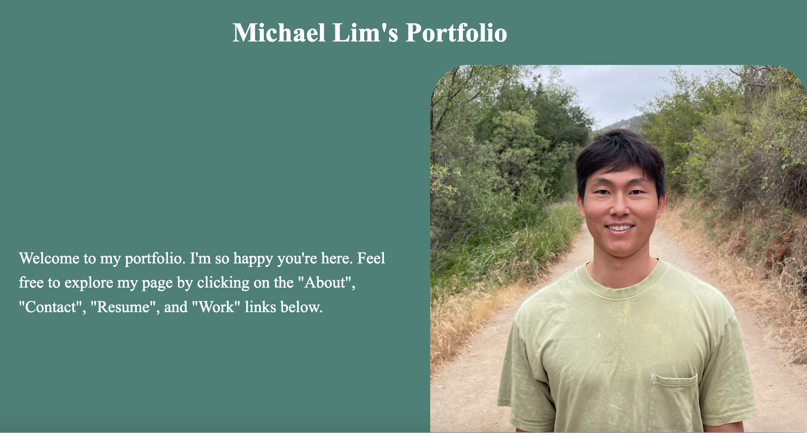

# Title:
Hello! This app is my portfolio with a section about me, a list of ways to contact me, a list of my skills, a link to my resume, and a section for my projects.

# Getting Started: 

Click the links below to my access my portfolio and Trello planning board:

[Michael Lim's Portfolio](https://portfolio-mmlim.netlify.app/ "Michael Lim's Portfolio")

[Michael Lim's Trello planning board](https://trello.com/b/fZVosSX8/michael-lim-portfolio/ "Michael Lim's Trello planning board")

# Screenshot:

# Technologies Used:

In making my portfolio, a Bootstrap card component was used to make asthetically pleasing cards for my tic tac toe project and future projects to fit inside. Thank goodness that Bootstrap exist!

Additionally I used Github to create a repository for my porfolio, Trello to make my plan board, Whimsical to make my wireframe, and VS Code to write my html, css, and javascript.

# Next Steps:

I plan to enhance my portfolio in the future by adding a dark mode feature. Additionaly, I plan to add sound to my portfolio.

